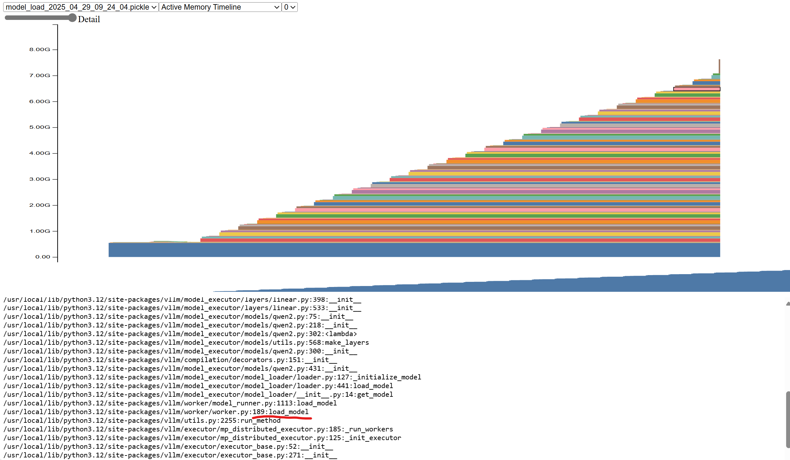
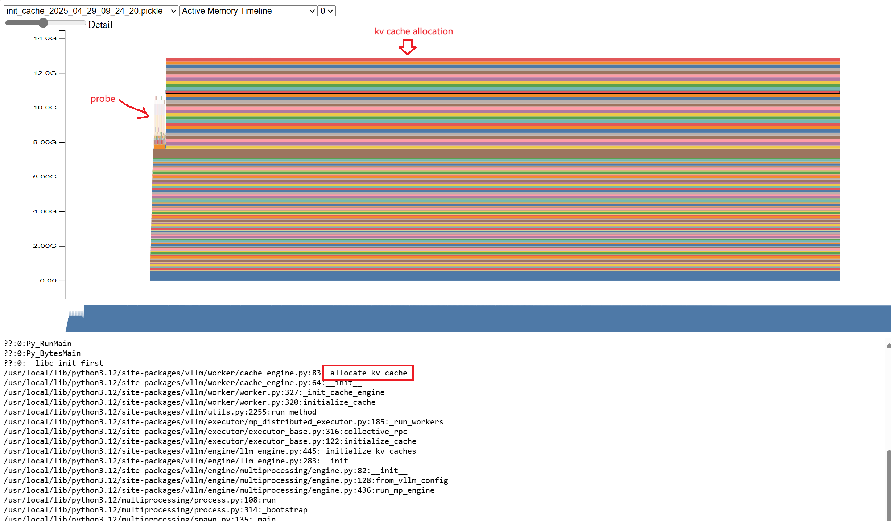
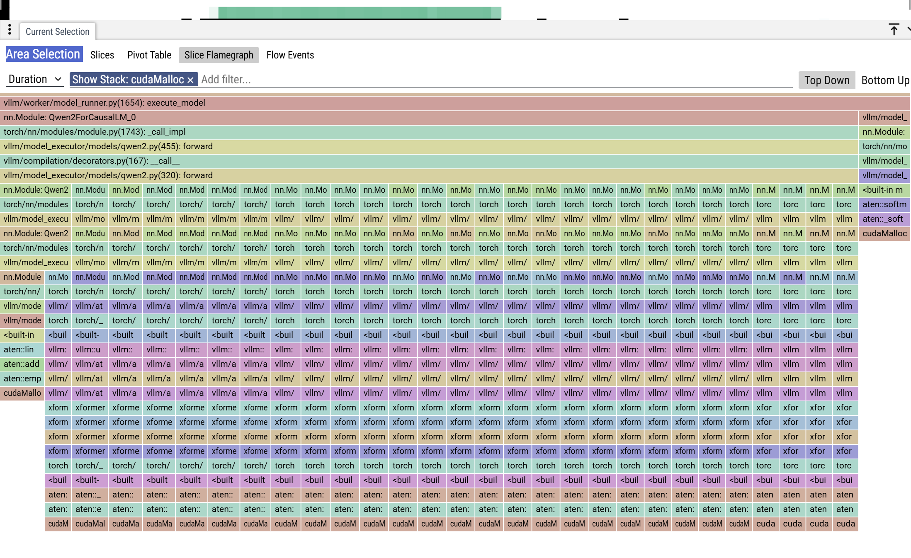
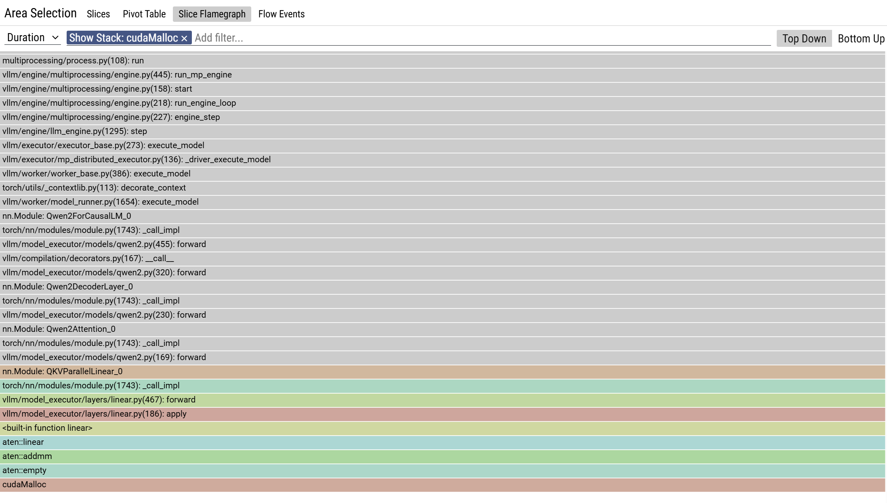
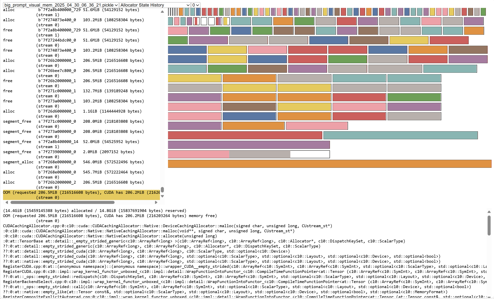

# Introduction 

This article mainly explains how VLLM manages memory. It also demonstrates how to analyze VLLM programs through profiling. 

At a high level of abstraction, VLLM manages memory based on PyTorch, and PyTorch manages memory based on CUDA. 
# CUDA Memory Management 

As a general-purpose data processing device, in order to meet customer needs more widely and ensure smaller maintenance costs, GPU's API is relatively open (rough) in design, although there are high-level APIs in the CUDA ecosystem, but they are not designed and optimized for a certain AI framework, in which the fine management of video memory is left to the upper-layer application to complete. Therefore, there is a set of memory management logic/mechanism in the PyTorch framework, which can better meet the needs of the framework, and can achieve detailed management and relatively efficient use compared with the native cudaAPI. 

CUDA has the following memory management methods: 

## cudaMalloc 

cudaMalloc/cudaFree is the most commonly used method of memory allocation. The cudaMalloc application requests for a continuous period of virtual memory. cudaMalloc/cudaFree has overhead and is a synchronous operation within the stream. 

This overhead is something that framework developers need to focus on, such as PyTorch, which pre-allocates memory pools through CUDA and then manages the memory itself in order to reduce the overhead of CUDA calls. 

## cuMemCreate 

[https://developer.nvidia.com/blog/introducing-low-level-gpu-virtual-memory-management/](https://developer.nvidia.com/blog/introducing-low-level-gpu-virtual-memory-management/) 

cuMemCreate is a cuda driver-level API. It allows for the remapping of virtual and physical addresses, which means that users can expand the allocated memory blocks, making it a more flexible way to manage them. 

PyTorch supports this management method starting from version 2.1.
It can be enabled via `PYTORCH_CUDA_ALLOC_CONF=expandable_segments:True`. 

[https://github.com/pytorch/pytorch/blob/main/c10/cuda/CUDACachingAllocator.cpp#L300](https://github.com/pytorch/pytorch/blob/main/c10/cuda/CUDACachingAllocator.cpp#L300) 


## cudaMallocManaged 

cudaMallocManaged is a unified management method with CPU memory. It allocates unified memory that is accessible by both the CPU and GPU. 

Currently, PyTorch does not support it. 

## PyTorch memory management 

The goal of PyTorch memory management is to reduce the overhead of API calls to GPU devices, while efficiently managing fragmentation in memory reclamation and usage. 

PyTorch **separates the process of applying for and using memory**. Applying refers to the application of memory through CUDA, and usage refers to the allocation of memory to PyTorch tensor. 

Pytorch introduces the concept of segments and blocks to manage memory. 

**Segment**: A large chunk of memory allocated directly from the GPU using cudaMalloc. 
**Block**: A subdivision of a segment, representing a portion of memory that can be allocated to tensors. 

The allocation process is as follows: 

1. Request Handling: When a tensor requests memory, the allocator rounds up the requested size to the nearest multiple of the alignment. 
2. Block Search: The allocator searches for a free block of the appropriate size within the cached segments. 
3. Block Splitting: If a larger free block is found, it may be split into smaller blocks to satisfy the request. 
4. Segment Allocation: If no suitable block is available, a new segment is allocated from the GPU, and a block of the required size is carved out.​ 

Deallocation process: 

Usually, when a user release memory blocks, PyTorch will just put it back into the memory pool and will not return back to system directly. Unless the user calls torch.memory.empty_cache(). 

After the block is freed, PyTorch will do a defragment, and when the addresses of two free blocks are consecutive, they will be merged into a single block. `cudaFree` is triggered only when the entire segment is idle 

There is a profiling tool provided by PyTorch [https://pytorch.org/docs/stable/torch_cuda_memory.html](https://pytorch.org/docs/stable/torch_cuda_memory.html)to help us understand the process of memory allocation. 

Let's take a look at the memory allocation behavior of vLLM. 

# vLLM memory allocation 

There are three main types of memory used by VLLMs for inference 

1. Model parameter memory 
2. Activation memory 
3. KV cache 

The activation memory is the intermediate state in which the calculation result is saved during the inference process. The longer the prompt length, the more memory is occupied by the activation memory. 

To accelerate inference performance, vLLM allocates the remaining memory to KV cache. 

Next, we validate our analysis with profiling: 

By default, vLLM only supports tracing on the call stack. We need to add some code to dump the memory snapshot. 

[https://github.com/zhuangqh/vllm/commit/1635685135e521b1bade9daeab295c774d0dc632](https://github.com/zhuangqh/vllm/commit/1635685135e521b1bade9daeab295c774d0dc632) 

```python
        torch.cuda.memory._record_memory_history(max_entries=10000) 
        from datetime import datetime 
        timestamp = datetime.now().strftime("%Y_%m_%d_%H_%M_%S") 
        filename = f"/workspace/visual_mem_{timestamp}.pickle" 
        torch.cuda.memory._dump_snapshot(file_name) 
```

The results of memory dump can be visualized with [https://pytorch.org/memory_viz](https://pytorch.org/memory_viz) 

**The analysis described below is based on the following configuration:** 
Model: qwen-2.5-coder-7b 
GPU: V100*2 

## Memory initialization 

Memory initialization during vllm server start. 

### Model loading 

After the vllm starts, the model is loaded first, and you can see that the memory usage gradually increases to 7.1GB, and all the memory allocation comes from the vllm/worker/worker.py:load_model function. 7.1GB is because we use 2 tensor parallelism, it only loads half the weight on each GPU. 



### kv cache allocation 

After the model is loaded, vLLM generates a fake request based on the configured model length and determines the peak memory by actually running the request once. After deducting the memory usage such as the activation memory in the peak memory, the remaining memory is allocated to kvcache. 



As you can see, if you run probe once, a certain amount of memory will be allocated. The remaining memory is allocated to kvcache. 

At this point, the resident memory is 12GB. 

## Runtime memory allocation 

Activation memory allocation occurs during inference. We can profile the call stack through the interface provided by VLLM. 
```bash
curl http://127.0.0.1:5000/start_profile 

curl http://127.0.0.1:5000/v1/chat/completions \ 
  -H "Content-Type: application/json" \ 
  -d '{ 
    "model": "phi-4-mini-instruct", 
    "messages": [ 
      { 
        "role": "user", 
        "content": "what is kubernetes" 
      } 
    ], 
    "temperature": 0.2, 
    "max_tokens":1000
  }' 

curl http://127.0.0.1:5000/stop_profile 
```


A trace.gz file is generated after it runs. 

Open that file in [https://ui.perfetto.dev/](https://ui.perfetto.dev/)  to see the flamegraph. 


You can see that there is a memory allocation during inference. Zoom in on the leftmost column 



You can see the call stack, cudaMalloc is invoked during the computation. The calling chain is ”run->execute_model->qwen.forward->QKVParallelLinear.forward”. This is activation. 

Traversing all the cudaMalloc call stacks, only the activation parameter yields a cuda memory allocation. kvcache does not trigger cudaMalloc. 

# Case study: OOM 

## Problem description 

Use two V100 to run the qwen2.5-coder-7b model. The model length is 32 K, gpu-memory-utilization=0.95, and the long prompt (30K) request will be OOM immediately when running a single concurrent request. When running a short prompt (24K) with multiple concurrencies, there is no OOM. 

## Problem analysis 

A long prompt may cause the activation parameter to use more memory. However, vllm used 32K prompt (model length) for probing during initialization, and this one ran successfully. After starting, it ran 30K but oom. 

Refetch the memory snapshot and switch to `Allocator State History` Tab. Here you can see the memory allocation record and the status of all the memory segments. 

On the left is the memory allocation record, which `segment_alloc` indicates that a piece of memory is requested through cudaMalloc. `alloc` is allocated from the mempool. 

On the right is the current segments status, and you can see that there are many memory blocks of different sizes. where the stained memory is allocated and the unstained memory is the unallocated memory. 



It can be seen that the request has a lot of memory allocation, and the request volume is relatively large, with 1 GiB and 500 MiB. 

Each segment has a little free memory, such as the bottom blank part, there is 133MiB of free memory, these are **memory fragments**. 

OOM Error message: `OutOfMemoryError('CUDA out of memory. Tried to allocate 208.00 MiB. GPU 0 has a total capacity of 15.77 GiB of which 206.19 MiB is free. Process 1729961 has 15.55 GiB memory in use. Of the allocated memory 14.46 GiB is allocated by PyTorch, with 46.00 MiB allocated in private pools (e.g., CUDA Graphs), and 292.57 MiB is reserved by PyTorch but unallocated`. 

**The last allocated request before OOM is 206.5 MiB, and the memory reserved in pytorch is 14.8 GiB and the allocated memory is 14.4 GiB, indicating that there is 400 MiB of free memory, but it cannot be allocated to the request. So pytorch creates a segment directly through cuda, but cuda only has 206.2 MiB memory left, so an OOM error occurs.** 

The cause of OOM is that there are too many memory fragments, and although the total free memory is sufficient, it cannot be allocated. At the same time, the system does not have enough memory buffers. 

(Question: Why cuda only has 206.2MiB of memory left, which adds up to 16GiB). 

Why don't short prompt requests OOM? 

|               |                        |                                  |                            |
| ------------- | ---------------------- | -------------------------------- | -------------------------- |
| Prompt Length | Peak Memory Allocation | Number of Allocations Over 1 GiB | Maximum Allocation Request |
| 30K           | 14.4 GiB               | 64                               | 1.2 GiB                    |
| 24K           | 14.1 GiB               | 60                               | 1.2 GiB                    |
| 10            | 12 GiB                 | N/A                              | 2 MiB                      |

As you can see, the longer prompt, more memory allocation is required. 

## Conclusion of the problem 

The longer the prompt, the more memory is used for the activation parameter. The larger block requests are allocated, the larger the single block fragment memory, and the less allocable memory remaining in the GPU, making it more difficult to meet subsequent large block memory requests. 

# Reference 

- [https://zdevito.github.io/2022/08/04/cuda-caching-allocator.html](https://zdevito.github.io/2022/08/04/cuda-caching-allocator.html) 
- [https://pytorch.org/docs/stable/torch_cuda_memory.html](https://pytorch.org/docs/stable/torch_cuda_memory.html) 
- [https://docs.vllm.ai/en/latest/contributing/profiling/profiling_index.html#profile-with-pytorch-profiler](https://docs.vllm.ai/en/latest/contributing/profiling/profiling_index.html#profile-with-pytorch-profiler)
- [https://zhuanlan.zhihu.com/p/680769942](https://zhuanlan.zhihu.com/p/680769942)